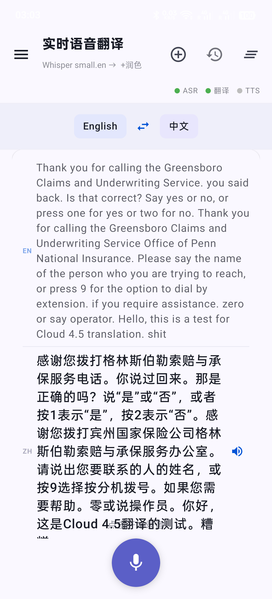
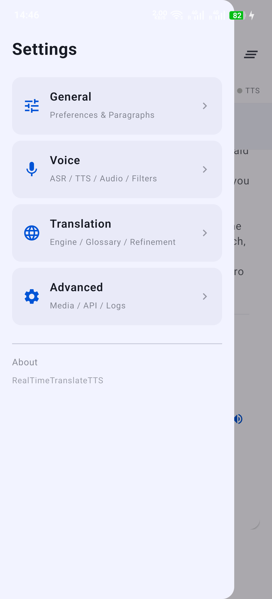
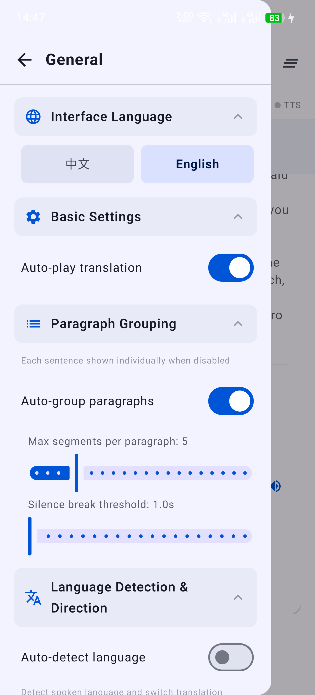
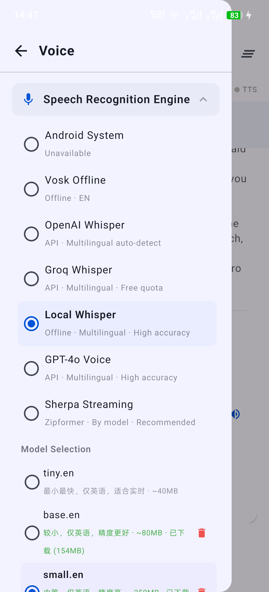
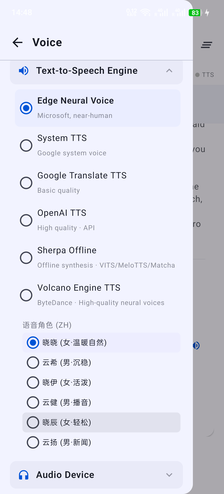
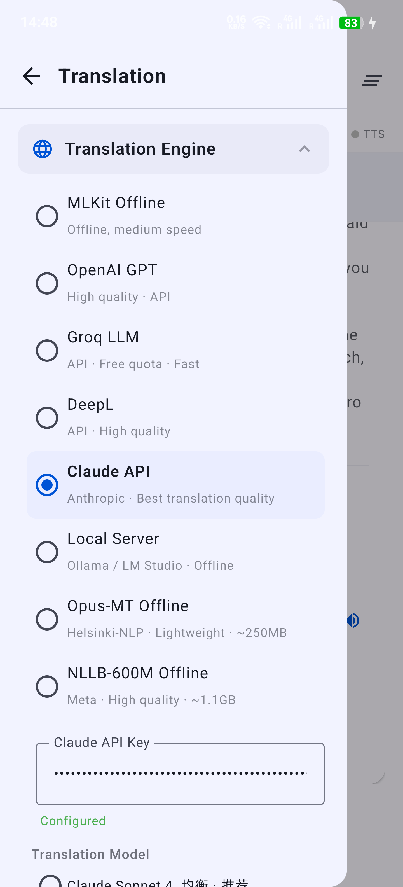
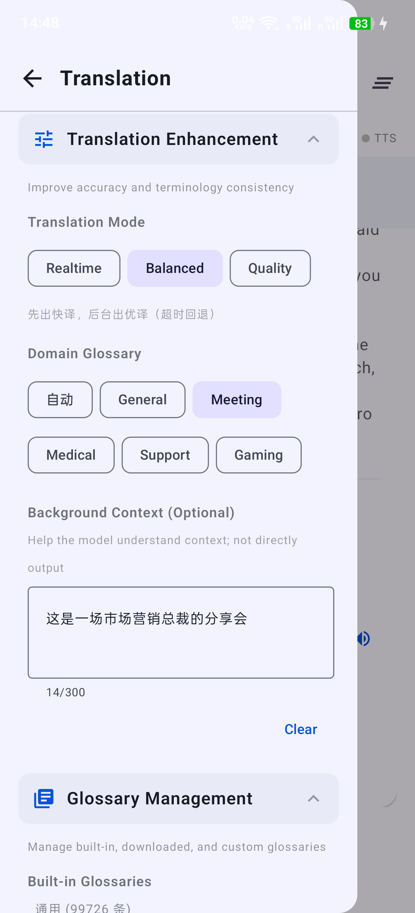
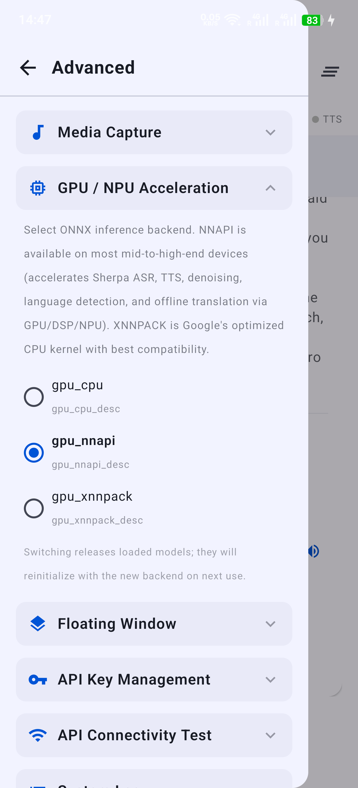

# RealTimeTranslateTTS

> [English](README.md) | **中文**

一款 Android 实时语音翻译（同声传译）应用，支持麦克风录音与系统媒体音频的语音识别、翻译和语音合成（TTS）。

## 应用截图

<p align="center">
  
  
  
  
</p>
<p align="center">
  
  
  
  
</p>

---

## 最新更新 (2026-04)

- **Claude API 接入**：翻译引擎 + AI 润色双通道，支持 Opus 4 / Sonnet 4 / Haiku 4.5 等全系列模型
- **火山引擎 TTS**：字节跳动高质量神经音色（灿灿、擎苍等 12+ 中文音色），支持多语言
- **GPU/NPU 加速**：统一 ONNX Provider 切换（CPU / NNAPI / XNNPACK），所有 Sherpa 模块 + 离线翻译均支持，初始化失败自动回退 CPU
- **API 密钥管理升级**：支持 6 种凭据增删查改（OpenAI / Groq / DeepL / Claude / 火山引擎 App ID + Token），服务器配置可直接编辑
- **API 连通测试升级**：新增 Claude 翻译测试 + 火山引擎 TTS 测试，全量测试一键运行
- **模型列表扩充**：OpenAI（GPT-4.1 / o4-mini / o3-mini）、Groq（DeepSeek R1）、Claude 全系列、本地（DeepSeek R1 7B）
- **v1.2.3 发布**：Sherpa 流式 ASR、统一离线 TTS 管线、Kokoro v1.1 中文音色
- **SWR 双通道翻译**：先快后优升级显示（Fast Path + Quality Path）
- **翻译上下文增强**：延迟模式、背景信息、领域提示、术语注入
- **术语库系统**：内置词库 + 开源下载 + 用户上传 CSV/TSV

---

## 功能概览

### 语音识别（ASR）
| 引擎 | 说明 |
|------|------|
| 系统 ASR | Android 原生语音识别，无需额外配置 |
| Vosk（离线） | 本地离线英文语音识别，无需网络 |
| Sherpa 流式 ASR | 基于 OnlineRecognizer，支持实时 partial + endpoint final，多模型可选 |
| OpenAI Whisper API | 通过 OpenAI API 调用 Whisper，识别准确度高 |
| Groq Whisper API | 通过 Groq API 调用 Whisper，速度快、延迟低 |
| GPT-4o Transcribe | OpenAI 最新转录模型 |
| 本地 Whisper（Sherpa-ONNX） | 设备端运行 Whisper ONNX 模型，完全离线，集成 Silero VAD |

### 翻译引擎
| 引擎 | 说明 |
|------|------|
| Google MLKit（离线） | 本地离线翻译，无需网络 |
| OpenAI GPT | 调用 OpenAI Chat API（GPT-4o / 4.1 等） |
| Groq LLM | 低延迟 LLM 翻译（Llama 3.3 70B 等） |
| DeepL | 高质量翻译（需 API Key） |
| **Claude API** | Anthropic Messages API（Sonnet 4 / Haiku 4.5 / Opus 4） |
| 本地服务器 | 自托管 LLM（Ollama / LM Studio，可自定义 URL + 模型名称） |
| Opus-MT / NLLB（离线） | 本地 ONNX 离线翻译，完全私密 |

### 文字转语音（TTS）
| 引擎 | 说明 |
|------|------|
| Microsoft Edge TTS | 微软神经网络语音（高质量，免费） |
| Android 系统 TTS | 原生系统语音 |
| Google Translate TTS | Google 翻译语音接口 |
| OpenAI TTS | OpenAI 语音合成 API（多角色） |
| Sherpa-ONNX 本地 TTS | 统一离线管线：VITS / Matcha / Kokoro / Kitten |
| **火山引擎 TTS** | 字节跳动高质量中文音色（灿灿、擎苍等） |

### 翻译增强
- **SWR 先快后优**：先返回低延迟结果，再在后台输出优译
- **延迟模式**：实时 / 平衡 / 质量
- **背景信息**：可选上下文帮助模型理解
- **领域路由**：auto / general / meeting / medical / customer_support / game
- **术语注入**：按领域自动注入，保持专有名词一致性

### AI 润色
支持 6 种润色提供者：Groq / OpenAI / **Claude** / 手机本机 / 局域网服务器 / 关闭。全系列模型可选。

### 术语库管理
- **内置词库**：通用、会议、医疗、客服、游戏
- **开源词库下载**：按来源下载并缓存
- **用户上传词库**：CSV/TSV 导入
- **优先级合并**：用户 > 下载 > 内置

### 媒体音频转译
通过 MediaProjection API（Android 10+）捕获系统音频，实时转录翻译。

### 浮动悬浮窗
离开主界面后自动弹出悬浮翻译窗口，后台持续运行。

### GPU / NPU 加速
- 支持 CPU / NNAPI / XNNPACK 三种 ONNX 执行提供器
- 覆盖所有 Sherpa ASR/TTS/VAD/降噪/语种检测 + 离线翻译（ORT）
- 初始化失败自动回退 CPU，日志打印实际使用的 provider

### API 密钥与测试
- **密钥管理**：6 种凭据一站式增删查改
- **连通测试**：逐步检查 DNS → 连接 → 认证 → 功能，支持全量与单独测试

### 其他
- 翻译历史（会话分组、搜索、重命名）
- TTS 回声抑制
- 智能 ASR 过滤（填充词/噪声/音乐/回声）
- 延迟指标面板（ASR / 翻译 / 润色 / TTS）
- 设备状态监控（CPU / 内存 / 电量 / 温度）
- 音频设备选择

---

## 系统要求

- **Android 8.0+**（API 26+）；媒体捕获需 Android 10+
- 麦克风权限（`RECORD_AUDIO`）
- 悬浮窗权限（`SYSTEM_ALERT_WINDOW`，可选）
- 媒体投影权限（可选）
- 网络权限（使用在线 API 时）

---

## 架构概览

```
MainActivity                ← 主界面（Jetpack Compose）
├── ASR Engines
│   ├── System / Vosk / SherpaStreamingAsr / SherpaWhisperAsr
│   └── WhisperApiAsr (OpenAI / Groq / GPT-4o)
├── TranslationPipeline     ← 并发翻译 + SWR 优译 + 有序输出
│   ├── TranslationContext  (latencyMode / background / domainHint)
│   ├── GlossaryManager     (术语路由与注入)
│   ├── TranslationEngine   (MLKit / LLM / DeepL / Claude / Server / ONNX)
│   ├── QualityEngine       (可选后台优译通道)
│   └── TranslationRefiner  (Groq / OpenAI / Claude / Local LLM)
├── TTS Consumer
│   └── Edge / System / Google / OpenAI / SherpaOnnx / Volcano
├── AccelerationConfig      ← ONNX Provider 统一配置与回退链
├── MediaCaptureService     ← 系统音频捕获 + ASR
└── FloatingTranslateService ← 后台悬浮翻译窗口
```

---

## 主要依赖

| 库 | 用途 |
|----|------|
| [Vosk](https://alphacephei.com/vosk/) | 离线语音识别 |
| [Sherpa-ONNX](https://github.com/k2-fsa/sherpa-onnx) | 本地 Whisper ASR + TTS |
| [Google MLKit](https://developers.google.com/ml-kit/language/translation) | 离线翻译 |
| [ONNX Runtime](https://onnxruntime.ai/) | 本地模型推理（NNAPI/XNNPACK） |
| [OkHttp](https://square.github.io/okhttp/) | HTTP / WebSocket |
| Jetpack Compose | UI 框架 |
| Kotlin Coroutines | 异步并发 |
